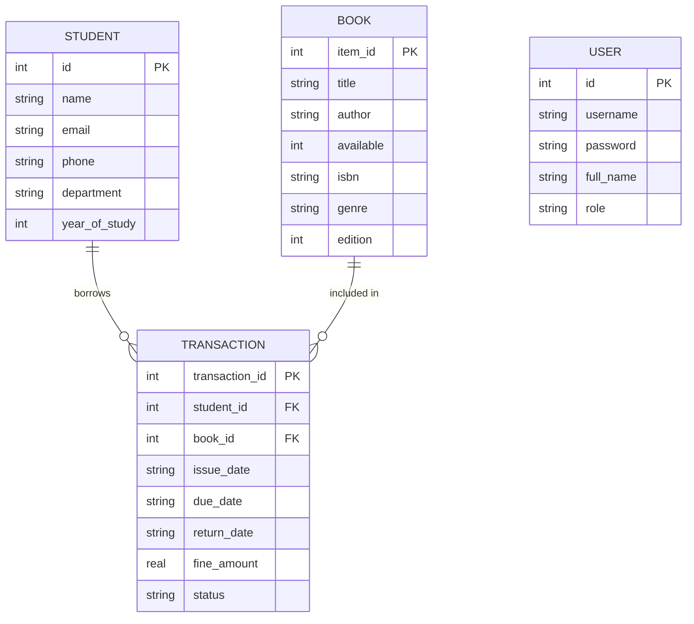

# Smart Campus Library Management System

[](https://www.oracle.com/java/)
[](https://github.com/xerial/sqlite-jdbc)
[](https://docs.oracle.com/javase/tutorial/essential/concurrency/)
[](com.library.test.TestRunner)
[](#)

> A modular, console-based desktop application written in pure Java SE that streamlines library circulation, inventory tracking, student membership records, and executive reporting using relational JDBC persistence, multithreaded auditing, and character-oriented streams.

---

## Table of Contents
1. [Project Title](#smart-campus-library-management-system)
2. [Overview of the Project](#overview-of-the-project)
3. [Features](#features)
4. [Technologies & Tools Used](#technologiestools-used)
5. [Steps to Install & Run the Project](#steps-to-install--run-the-project)
6. [Instructions for Testing](#instructions-for-testing)
7. [Screenshots](#screenshots)
8. [Project Architecture & Database Design](#project-architecture--database-design)
9. [Project Directory Structure](#project-directory-structure)

---

## Overview of the Project

The **Smart Campus Library Management System** provides academic departments and educational institutions with a lightweight, robust, and standalone library circulation and catalog engine. 

### Problem Context
Academic institutions and departmental libraries frequently struggle with manual record keeping, untracked book loans, misplaced inventory, delayed return notifications, and inconsistent late fine calculations. Existing commercial enterprise library solutions are often heavy, cloud-dependent, and difficult to set up locally.

### Solution
This project delivers a complete desktop solution written in pure Core Java. It demonstrates clean Object-Oriented Architecture (OOP), Data Access Object (DAO) patterns, and ACID-compliant relational persistence via embedded SQLite without requiring heavyweight web containers or external database server installations.

### Target Users & Personas
- **Chief Administrators (`ADMIN`)**: System-wide configuration, user role provisioning, database auditing, and global report extraction.
- **Campus Librarians (`LIBRARIAN`)**: Book inventory management, catalog updates, student registration, checking out books, handling returns, and fee assessment.
- **Enrolled Students (`STUDENT`)**: Inquiring about catalog availability, checking due dates, and tracking personal borrowing histories.

---

## Features

### 1. User Authentication & Role-Based Access Control
- Secure console-based login and user self-registration.
- Three distinct role levels with tailored permissions: `ADMIN`, `LIBRARIAN`, and `STUDENT`.
- Session management displaying active username and privileges across all menus.
- Pre-seeded default credentials for rapid evaluation and testing.

### 2. Student Records Management
- Enrolls students with full contact details, academic department (CSE, ECE, MECH, etc.), and year of study.
- Format-enforced data validation for student emails and phone numbers.
- Polymorphic search capabilities: search students by unique numeric ID or by department/name keywords.
- In-place student profile updates.

### 3. Book Catalog & Inventory Management
- Add books categorized by academic discipline via `BookGenre` enums (`COMPUTER_SCIENCE`, `MATHEMATICS`, `PHYSICS`, `FICTION`, etc.).
- Formatted tabular catalog display showcasing IDs, titles, authors, availability statuses, genres, and ISBNs.
- Polymorphic search: query books by unique numeric ID or by title/author substrings.
- Safe deletion validation: prevents accidental removal of books currently checked out to students.

### 4. Circulation & Atomic Transaction Management
- **Issue Workflow**: Enforces instant availability checks, creates loan records, and atomically toggles book availability with JDBC transaction rollback protection (`conn.setAutoCommit(false)`).
- **Return Workflow**: Automatically computes difference between scheduled due date and actual return date.
- **Overdue Fine Engine**: Overloaded penalty calculation applying standard rates (₹5.00/day) or custom departmental fine rates.
- **Student History**: Lookup complete active and historical loan records for any registered student.

### 5. Multithreading & Asynchronous Concurrency
- Background daemon worker thread (`AuditLogThread`) continuously monitors and records transaction events.
- Thread-safe synchronized message queues prevent race conditions and maintain strict audit trail integrity.
- Real-time thread diagnostics dashboard displaying thread state, ID, priority, and daemon status.

### 6. Analytics & Character-Oriented File I/O
- Character-oriented stream file generation (`BufferedWriter` and `PrintWriter`) exporting executive summaries to `library_summary_report.txt`.
- Stream reading (`BufferedReader` and `FileReader`) parsing and displaying persisted reports directly in the console.
- **2-D Array Statistics Matrix**: Real-time aggregation of total and available copies categorized by genre.
- **LIFO Stack Operation Tracking**: Backed by `java.util.Stack` to track and display recent user and system actions in reverse chronological order.

---

## Technologies/Tools Used

| Category | Technology / Tool | Purpose in Project |
| :--- | :--- | :--- |
| **Language** | **Java SE (JDK 8 / 17 / 21 / 26)** | Core language utilizing OOP, Generics, Enums, Collections, and Concurrency |
| **Database** | **SQLite 3 (`library.db`)** | Embedded, serverless relational database engine requiring zero external configuration |
| **Data Access** | **Java Database Connectivity (JDBC)** | Parameterized `PreparedStatement`, `Statement`, `ResultSet`, and atomic transactions |
| **Configuration** | **`db.properties`** | Externalized configuration file decoupling driver class and connection URL from code |
| **Libraries** | **`sqlite-jdbc-3.45.1.0.jar`** | Pure Java SQLite JDBC driver |
| **Logging** | **`slf4j-api-1.7.36.jar`**, **`slf4j-simple-1.7.36.jar`** | Standardized logging abstraction layer |
| **Design Patterns** | **Singleton, DAO, Static Nested Class** | Thread-safe `DatabaseManager`, isolated Data Access Objects, and clean separation of concerns |
| **Testing** | **Custom Automated Test Suite (`TestRunner`)** | 17 automated verification test cases covering all modules without external test runners |
| **CLI & Build** | **Standard Java CLI (`javac`, `java`)** | Compile and execute standalone bytecode without heavyweight build tools |

---

## Steps to Install & Run the Project

### Prerequisites
- **Java SE Development Kit (JDK)**: Version 8 or higher installed (tested on Java 17, Java 21, and Java 26).
  - Verify your installation by opening a terminal and running:
    ```bash
    java -version
    javac -version
    ```
- **Operating System**: Windows, Linux, or macOS.
- **Database Server**: **None required**. SQLite runs embedded using the bundled JARs in `lib/`.

---

### Step 1: Clone or Navigate to the Project Directory
```bash
# Clone the repository (or navigate to your local extracted folder)
cd "Java Library Management System"
```

---

### Step 2: Compile the Java Source Code
Compile all application packages into the `bin/` directory:

**On Windows (PowerShell / Command Prompt):**
```powershell
javac -cp "lib/*;src" -d bin src/com/library/model/*.java src/com/library/exception/*.java src/com/library/dao/*.java src/com/library/service/*.java src/com/library/thread/*.java src/com/library/util/*.java src/com/library/main/*.java src/com/library/test/*.java
```

**On Linux / macOS (Bash):**
```bash
javac -cp "lib/*:src" -d bin src/com/library/model/*.java src/com/library/exception/*.java src/com/library/dao/*.java src/com/library/service/*.java src/com/library/thread/*.java src/com/library/util/*.java src/com/library/main/*.java src/com/library/test/*.java
```

---

### Step 3: Run the Interactive Console Application
Launch the menu-driven library system:

**On Windows:**
```powershell
java --enable-native-access=ALL-UNNAMED -cp "bin;lib/*" com.library.main.LibraryApp
```

**On Linux / macOS:**
```bash
java --enable-native-access=ALL-UNNAMED -cp "bin:lib/*" com.library.main.LibraryApp
```

---

### Pre-Configured Demo Credentials
When prompted at the Authentication Portal, log in with any of the following pre-seeded test accounts:

| Username | Password | User Full Name | Assigned Role | Permissions |
| :--- | :--- | :--- | :--- | :--- |
| `admin` | `admin123` | Chief Administrator | `Administrator` | Full access: Student, Book, Circulation, Reports, and Thread Monitor |
| `librarian` | `lib123` | Campus Librarian | `Librarian` | Catalog management, student registration, issue & return operations |
| `student` | `student123` | Enrolled Student | `Student` | Catalog viewing, availability inquiries, and loan history lookup |

---

## Instructions for Testing

The system includes a dedicated automated test suite (`com.library.test.TestRunner`) that validates all functional modules and system requirements in a single command.

### Running the Automated Test Suite

Execute the test suite from the terminal:

**On Windows (PowerShell / Command Prompt):**
```powershell
java --enable-native-access=ALL-UNNAMED -cp "bin;lib/*" com.library.test.TestRunner
```

**On Linux / macOS:**
```bash
java --enable-native-access=ALL-UNNAMED -cp "bin:lib/*" com.library.test.TestRunner
```

### Automated Test Coverage Checklist
The test suite runs 17 automated tests and reports individual status for each:

1. **[TEST 1] Register Student & Retrieve**: Verifies student insertion and primary key generation.
2. **[TEST 2] Overloaded Student Search**: Tests department keyword search filter.
3. **[TEST 3] Update Student Details**: Validates in-place field updates in SQLite.
4. **[TEST 4] Add Book & Retrieve**: Tests book creation and catalog persistence.
5. **[TEST 5] Overloaded Book Search**: Verifies title/author keyword search.
6. **[TEST 6] Book Availability Check**: Confirms availability flag prior to issuance.
7. **[TEST 7] Issue Book Transaction**: Tests atomic loan creation and availability toggle (`available = false`).
8. **[TEST 8] Custom Exception Handling**: Confirms `BookNotAvailableException` is triggered when double-issuing.
9. **[TEST 9] Return Book & Fine Calculation**: Simulates a 4-day overdue return and validates penalty calculation (₹20.00).
10. **[TEST 10] LIFO Activity Stack**: Verifies `java.util.Stack` pushes and pops recent operations.
11. **[TEST 11] 2-D Array Statistics Matrix**: Tests genre-wise breakdown matrix computation.
12. **[TEST 12] Character-Oriented File I/O**: Tests `BufferedWriter`/`PrintWriter` export and `BufferedReader`/`FileReader` report retrieval.
13. **[TEST 13] Multithreaded Concurrency**: Verifies asynchronous queue consumption and thread liveness in `AuditLogThread`.
14. **[TEST 14] Authentication (Valid Login)**: Verifies password authentication and role assignment for `admin`.
15. **[TEST 15] Authentication (Invalid Password)**: Verifies `AuthenticationException` rejection upon incorrect credentials.
16. **[TEST 16] User Registration**: Tests new user account creation and credential persistence.
17. **[TEST 17] User Logout & Audit**: Verifies user session termination and audit logging.

---

## Screenshots

### 1. Automated Verification Test Suite (17/17 Passed)
Demonstrating the full automated test suite execution verifying all functional and architectural modules:


---

### 2. Authentication Portal & Role-Based Login
Displaying user login as `admin`, credential authentication, role resolution (`Administrator`), and the interactive Main Menu:


---

### 3. Book Management & Inventory Catalog
Displaying the tabular book catalog with polymorphic columns (Item ID, Title, Author, Availability status, Genre, and ISBN):


---

### 4. Circulation: Book Issue & Overdue Fine Return
Displaying atomic checkout to a student and check-in with automatic 4-day overdue detection and late fee calculation:


---

### 5. Reports, 2-D Genre Matrix & File I/O
Displaying executive summary report generation via character output streams (`BufferedWriter`/`PrintWriter`), reading back via `BufferedReader`, and the 2D array genre inventory breakdown matrix:


---

## Project Architecture & Database Design

### System Layer Architecture
```
+-------------------------------------------------------------+
|                      Presentation Layer                     |
|                 (com.library.main.LibraryApp)               |
+------------------------------+------------------------------+
                               |
                               v
+-------------------------------------------------------------+
|                        Service Layer                        |
|       (LibraryService implements Manageable<Book>)          |
+---------------+-----------------------------+---------------+
                |                             |
                v                             v
+-------------------------------+  +--------------------------+
|       Multithreading Worker   |  |   Java I/O Reporting     |
|       (AuditLogThread)        |  |   (ReportGenerator)      |
+-------------------------------+  +--------------------------+
                |
                v
+-------------------------------------------------------------+
|                     Data Access Layer (DAO)                 |
|       (StudentDAO, BookDAO, TransactionDAO, DatabaseManager)|
+------------------------------+------------------------------+
                               |
                               v
+-------------------------------------------------------------+
|                 Relational Database Storage                 |
|                  (SQLite: library.db via JDBC)              |
+-------------------------------------------------------------+
```

### Relational Database Schema (ER Diagram)


---

## Project Directory Structure

```
Java Library Management System/
├── bin/                                # Compiled .class bytecode
├── lib/                                # Standalone JDBC driver & logging JARs
│   ├── sqlite-jdbc-3.45.1.0.jar        # SQLite JDBC Driver
│   ├── slf4j-api-1.7.36.jar            # SLF4J API
│   └── slf4j-simple-1.7.36.jar         # Simple logger implementation
├── screenshots/                        # High-resolution terminal output screenshots
│   ├── 01_automated_test_suite.png     # Automated test suite run
│   ├── 02_auth_portal_login.png        # Authentication & login flow
│   ├── 03_book_catalog_inventory.png   # Book catalog table display
│   ├── 04_circulation_issue_return.png # Issue & overdue return workflow
│   └── 05_executive_summary_report.png # Summary report & 2-D genre matrix
├── scripts/                            # Utility and helper scripts
│   └── generate_screenshots.py         # Terminal screenshot generator
├── src/                                # Java source code
│   └── com/
│       └── library/
│           ├── model/                  # Domain entity models
│           │   ├── Person.java         # Abstract base person class
│           │   ├── Student.java        # Inherits Person
│           │   ├── LibraryItem.java    # Abstract base catalog item
│           │   ├── Book.java           # Inherits LibraryItem
│           │   ├── Transaction.java    # Circulation record model
│           │   ├── User.java           # Authentication credential model
│           │   ├── BookGenre.java      # Enum with names and codes
│           │   ├── TransactionStatus.java # Status enum (ISSUED, RETURNED, OVERDUE)
│           │   └── UserRole.java       # Role enum (ADMIN, LIBRARIAN, STUDENT)
│           ├── dao/                    # Data Access Objects (JDBC)
│           │   ├── DatabaseManager.java# Thread-safe Singleton connection & DDL manager
│           │   ├── StudentDAO.java     # Student CRUD operations
│           │   ├── BookDAO.java        # Book catalog CRUD operations
│           │   ├── TransactionDAO.java # Circulation transactions & history
│           │   └── UserDAO.java        # User authentication & credentials
│           ├── service/                # Core business logic
│           │   ├── Manageable.java     # Generic interface for entities
│           │   └── LibraryService.java # Business rules, fines, stack tracking
│           ├── thread/                 # Multithreading & Synchronization
│           │   └── AuditLogThread.java # Daemon worker thread for audit events
│           ├── exception/              # Custom checked exception hierarchy
│           │   ├── LibraryException.java
│           │   ├── AuthenticationException.java
│           │   ├── BookNotAvailableException.java
│           │   └── RecordNotFoundException.java
│           ├── util/                   # Utility helpers
│           │   ├── InputValidator.java # Console input parser and regex validator
│           │   └── ReportGenerator.java# Character streams (BufferedReader / PrintWriter)
│           ├── main/
│           │   └── LibraryApp.java     # Interactive CLI main application
│           └── test/
│               └── TestRunner.java     # Automated verification suite (17 tests)
├── db.properties                       # Externalized JDBC configuration
├── library.db                          # SQLite persistent database file
├── library_summary_report.txt          # Exported character stream summary report
├── statement.md                        # Project requirements & specifications
└── README.md                           # Main comprehensive project documentation
```

---

## References
1. Herbert Schildt, *Java: The Complete Reference*, 11th Edition, Oracle Press / McGraw-Hill.
2. Cay S. Horstmann, *Core Java Volume I – Fundamentals*, 11th Edition, Pearson.
3. Oracle Java SE Official Documentation: [https://docs.oracle.com/en/java/javase/](https://docs.oracle.com/en/java/javase/)
4. SQLite JDBC Driver Repository: [https://github.com/xerial/sqlite-jdbc](https://github.com/xerial/sqlite-jdbc)
